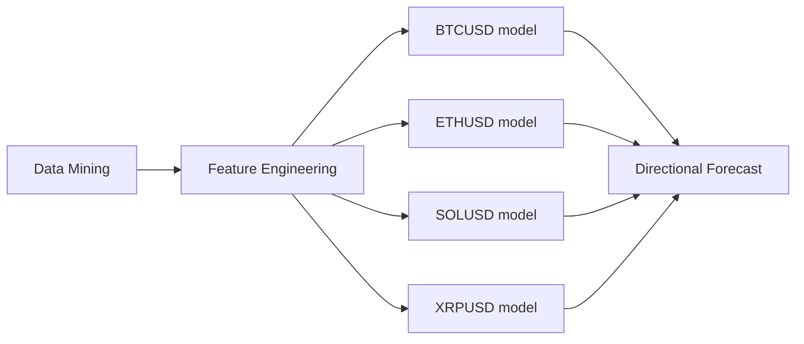

# XGBoost Directional Prediction — Crypto 1H Polymarket

An end-to-end quantitative research project investigating whether 
cross-asset correlation improves directional prediction accuracy 
for 1-hour crypto contracts across BTCUSD, ETHUSD, SOLUSD, and XRPUSD.

---

## Research Question

Does incorporating cross-asset correlation features into an XGBoost 
model improve directional prediction accuracy and reduce risk exposure 
compared to single-asset models?

---

## Pipeline

---

## Methodology

Hourly OHLCV data was collected from 2022–2026 across four assets, 
with 144 features engineered per asset — producing a wide cross-asset 
dataset of 576 features. An XGBoost classifier was trained using walk-forward 
validation across 34 folds to evaluate out-of-sample generalisation. 
Permutation analysis was applied to assess statistical robustness and 
rule out data leakage or overfitting.

---

## Key Results

| Metric | In-Sample | Out-of-Sample |
|---|---|---|
| Total Trades | 88,503 | 12,867 |
| Win Rate | 53.69% | 52.40% |
| Total Returns | 6,535% | 617% |
| Max Drawdown | 43.41% | 37.50% |
| Permutation p-value | 0.0099 | 0.0099 |

**Interpretation:** The model maintained consistent directional edge 
out-of-sample with statistically significant results. Feature stability 
was weaker than anticipated, suggesting cross-correlation features 
shift importance across market regimes.

---

## Project Status

**Deprecated.** Strategy discontinued following changes in market 
conditions and platform viability. No ongoing support or maintenance 
will be provided.

---

## Disclaimer

This software is provided for research and educational purposes only. 
Historical performance does not guarantee future results. This is not 
financial advice. The author accepts no responsibility for any outcomes 
arising from use of this software.
